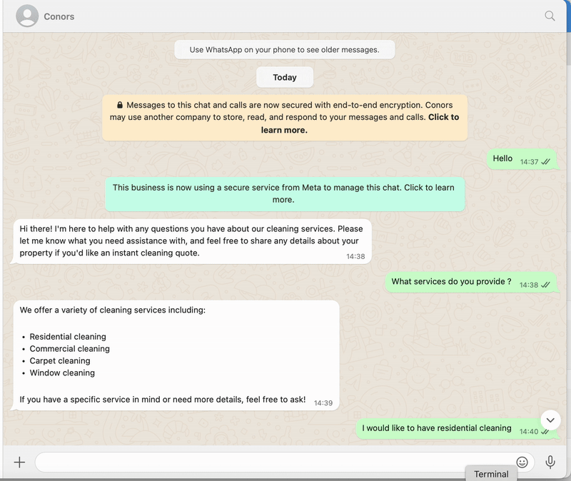

# Agentic-AI-build (GUI based Framework)
🤖 WhatsApp-Based AI Customer Support & Lead Generation Agent
Project Summary:
Developed and deployed a smart AI assistant on WhatsApp using Agentive to serve as a conversational lead generation and support agent for Cleaning Business Service. The system engages prospects in real time, answers their service-related queries, generates pricing quotes, and captures lead information for follow-up and appointment booking.

# Business Use Case / Workflow:

A prospect finds the WhatsApp number (on a website, QR code, or ad) and sends a text message.

The AI responds with personalized info pulled from company KB documents.

If relevant, the bot calculates a quote. Also It gathers and logs lead info if the user is interested.

🧩 Tech Stack & Tools Used
- **Agentive AI**  
  Built and deployed the WhatsApp chatbot agent to manage customer conversations, simulate human-like dialogue, and maintain context across sessions.
  

- **Relevance AI**  
  Developed dynamic tools like the “Airtable Lead Data Collector” and “Sparkly Cost Estimator”, based on custom business logic, and integrated them into the AI agent to 
  calculate real-time pricing and capture customer lead data.
  
  
- **Knowledge Base**  
  Used Agentive AI’s built-in document-based Q&A system to answer FAQs using company-provided files.

- **API Integrations**  
  Connected to both Relevance AI and Airtable via API calls. 

- **Airtable**  
  Used as a lightweight CRM backend to store customer data including contact info, service requirements, and quote history.
   
   
- **LLM**
  powered by LLMs like OpenAI or DeepSeek.

---
# Business Value:

✅ Builds trust by engaging on a familiar mobile-native platform like whatsapp

✅ Reduces friction by eliminating web forms and slow email replies

✅ Converts casual interest into booked appointments or qualified leads
