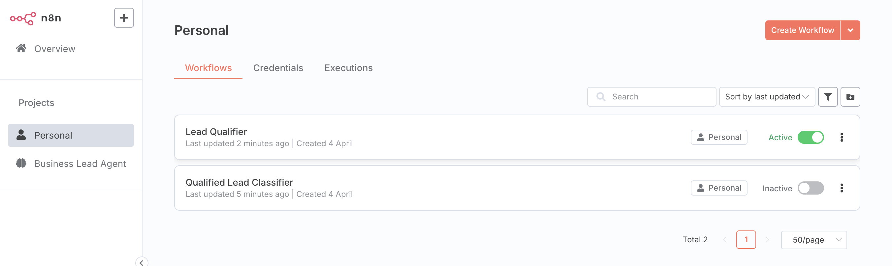
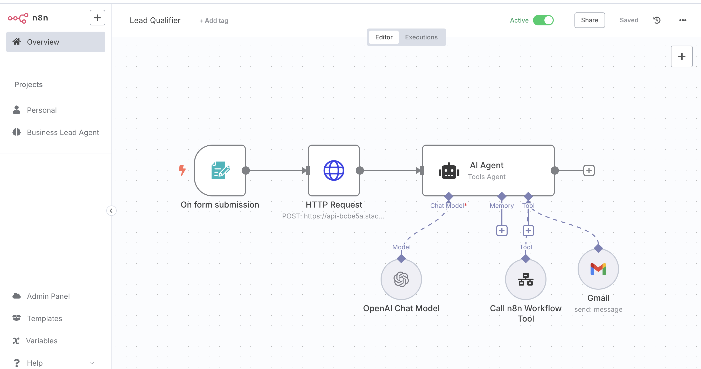
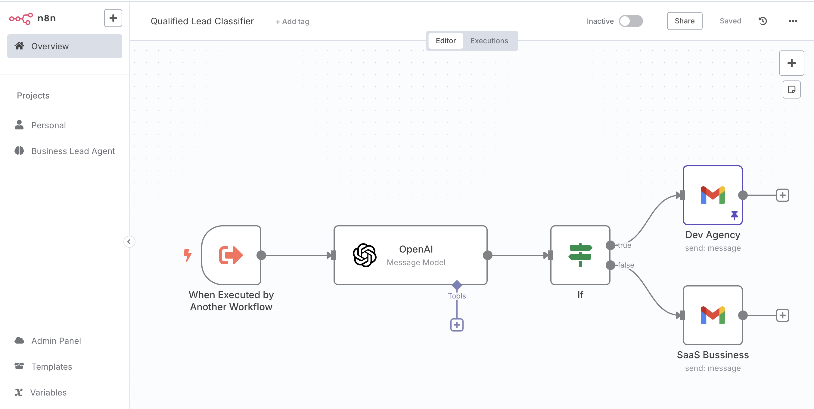

# Agentic-AI-builds for business usecases (GUI based Framework)

# 🤖 WhatsApp-Based AI Customer Support & Lead Generation Agent – Build 1
Project Summary:
Developed and deployed a smart AI assistant on WhatsApp using Agentive to serve as a conversational lead generation and support agent for Cleaning Business Service. The system engages prospects in real time, answers their service-related queries, generates pricing quotes, and captures lead information for follow-up and appointment booking.

# Business Use Case / Workflow:

A prospect finds the WhatsApp number (on a website, QR code, or ad) and sends a text message.

The AI responds with personalized info pulled from company KB documents.

If relevant, the bot calculates a quote. Also It gathers and logs lead info if the user is interested.

🧩 Tech Stack & Tools Used
- **Agentive AI**  
  Built and deployed the WhatsApp chatbot agent to manage customer conversations, simulate human-like dialogue, and maintain context across sessions.
  

- **Relevance AI**  
  Developed dynamic tools like the “Airtable Lead Data Collector” and “Sparkly Cost Estimator”, based on custom business logic, and integrated them into the AI agent to 
  calculate real-time pricing and capture customer lead data.
  
  
- **Knowledge Base**  
  Used Agentive AI’s built-in document-based Q&A system to answer FAQs using company-provided files.

- **API Integrations**  
  Connected to both Relevance AI and Airtable via API calls. 

- **Airtable**  
  Used as a lightweight CRM backend to store customer data including contact info, service requirements, and quote history.
   
   
- **LLM**
  powered by LLMs like OpenAI or DeepSeek.

---
# Business Value:

✅ Builds trust by engaging on a familiar mobile-native platform like whatsapp

✅ Reduces friction by eliminating web forms and slow email replies

✅ Converts casual interest into booked appointments or qualified leads

# 🤖 AI Lead Qualification Agent – Build 2

### Automating Lead Filtering Using n8n, Relevance AI & OpenAI

---

### 🧠 Project Overview

This project automates **lead qualification** for inbound submissions using an AI-powered agent built on the **n8n workflow engine** with integrations from **Relevance AI**, **OpenAI**, and **Gmail**. The system classifies whether a new lead is qualified (e.g., SaaS company vs. agency), and routes them to the appropriate next step — saving manual effort and speeding up sales response time.

---

### 💼 Problem Statement

Companies that market themselves well often get flooded with inbound leads — but not all leads are useful:
- ❌ Too small
- ❌ Wrong industry
- ❌ Not a good business fit

Instead of:
- Hiring people to qualify leads manually  
- Using rigid filters that risk missing good leads  

➡️ **This agent uses AI to evaluate and qualify leads dynamically.**

---

### 🔁 Workflow Breakdown

1. **Trigger:** A form submission activates the n8n workflow.
2. **Research:** Relevance AI fetches company information from the web (e.g., LinkedIn, websites).
3. **Analysis:** OpenAI analyzes the data and classifies the lead.
4. **Routing:**
   - Qualified → Qaulfied Leads are classified based on BU's and internal teams are notified via Gmail
   - Not qualified → Automated Email politely declines
5. **Logging:** Sends classification back to Airtable/CRM if required.

---

### 🧰 Tools & Integrations

| Tool           | Usage                                       |
|----------------|---------------------------------------------|
| **n8n**        | Workflow automation and event orchestration |
| **Relevance AI** | Company research, scraping, and enrichment |
| **OpenAI (GPT)** | Language model to interpret and qualify leads |
| **Gmail**        | Sends lead qualification  emails   |
| **Form/Webhook** | Captures user submissions to start workflow |

---

### 📈 Business Impact

- ✅ Saves hours of manual lead triage
- ✅ Enables smarter filtering than static rules
- ✅ Accelerates sales response times
- ✅ Easily scalable to different industries and segments

---

### 🧠 Visual Flow (Example)

> 
> 
> 

---

